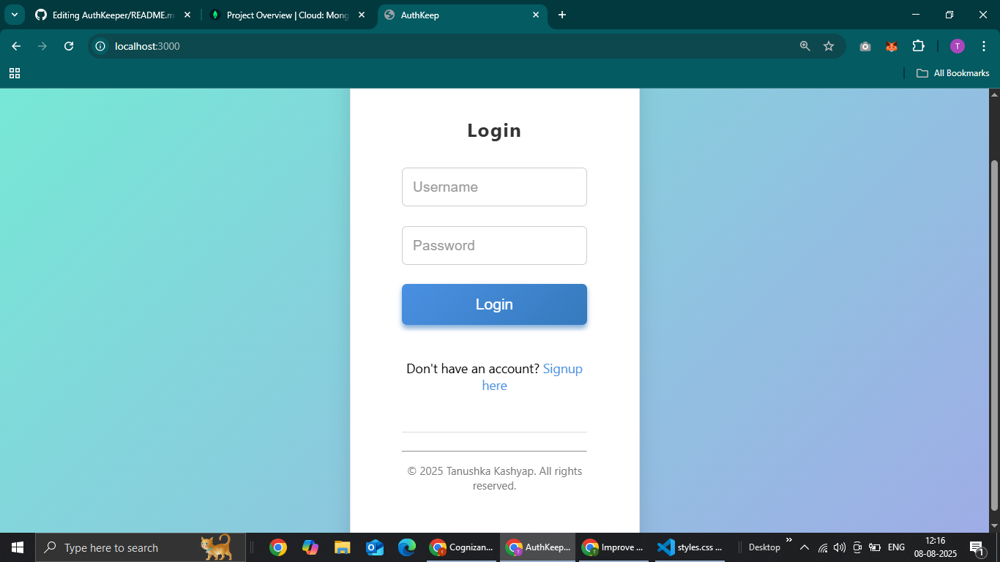

# Fullstack Vanilla JS + Node/Express + MongoDB + JWT

## Overview
A simple resume-level fullstack project:
- Frontend: Vanilla JS, HTML, CSS (in `/frontend`)
- Backend: Node.js + Express + MongoDB + JWT auth (in `/backend`)
- Features: Signup, Login (JWT), Protected CRUD for items

## Quick start (local)

1. MongoDB:
   - Option A: Run local MongoDB and use `mongodb://127.0.0.1:27017/fullstack_demo`
   - Option B: Use Atlas and set `MONGO_URI` in backend/.env 

2. Backend:
```bash
cd backend
cp .env.example .env
# edit .env and set MONGO_URI and JWT_SECRET
npm install
npm start
```

3. Frontend:
- Open `frontend/index.html` in browser OR
- If backend serves frontend (default), visit http://localhost:5000

## Deploying

### Option 1: Deploy backend and frontend together (single deploy)
- Use Render or Heroku (recommended for beginners)
- Ensure environment variables are set (`MONGO_URI`, `JWT_SECRET`)

### Option 2: Deploy frontend separately (Netlify/Vercel) and backend on Render/Railway
- If deploying frontend separately, update `apiBase` in `frontend/js/*.js` to full backend URL (e.g. `https://your-backend.onrender.com/api`)

## How frontend + backend connect
- Frontend uses `fetch('/api/...')` so when both hosted together the browser calls backend endpoints at `/api`
- The backend checks `Authorization: Bearer <token>` header (JWT) for protected routes

## ScreenShot
- 

## Notes
- This project is intentionally minimal and easy to understand.
- For production, consider better error handling, input validation, HTTPS, and refreshing tokens.

